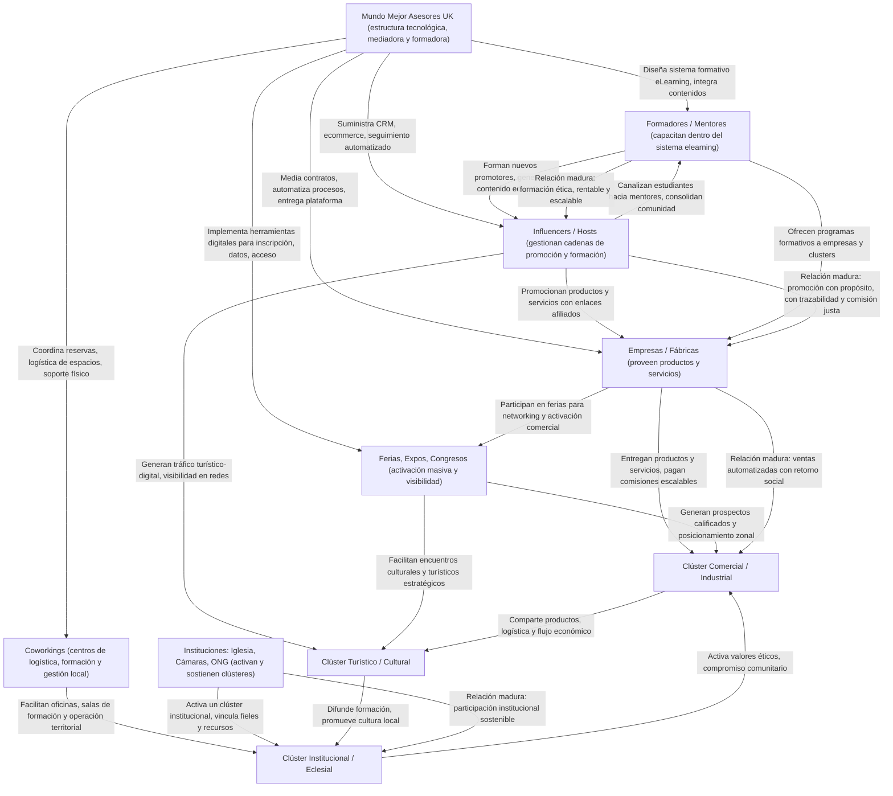

 
Declaración de Intención
Lo que presento no es una propuesta cerrada, ni una idea con nombre fijo, porque todavía está naciendo. Es una intuición profunda, una visión que reconoce que todos los sectores de la sociedad—religiosos, políticos, económicos, turísticos, comerciales, industriales y otros—están llamados a participar en algo más grande que ellos mismos. Esta idea busca ser una especie de “pega dinámica”, un vínculo vivo, relacional, transformador, que una desde dentro a instituciones, personas y estructuras que normalmente actúan por separado.

No se trata solo de articular colaboraciones funcionales, sino de construir un misterio de comunión entre actores muy distintos, donde cada uno pueda reconocerse convocado desde lo que es y lo que tiene para dar. La dificultad principal es que cada uno habla un idioma distinto: cada actor social tiene su propio lenguaje, códigos, objetivos e intereses. Por eso, esta visión aún no tiene un nombre único: porque debe hablar a cada quien en su idioma, pero convocarlos a un mismo horizonte.

La meta es clara: contribuir de manera concreta y estructural a hacer un mundo mejor, donde el desarrollo humano integral no sea una promesa abstracta, sino una transformación real, visible, efectiva. Pero para que esto ocurra, necesitamos un lenguaje común, una narrativa que haga posible la articulación entre actores diversos sin borrar sus identidades.

Cuando me envíes los documentos, podré ayudarte a construir esa narrativa común, a nombrar esos agentes con criterios que equilibren universalidad y especificidad, para que nadie quede fuera, pero todos se sientan interpelados y necesarios.

---

Gracias por compartir los documentos y las imágenes. Con esto, ya puedo ayudarte a interpretar y articular las piezas del rompecabezas con base en el **contexto permanente** que establecimos (la idea como “pega dinámica” para toda la sociedad). A continuación te presento un primer **análisis estructural e interpretativo**, centrado en cómo se conectan la **Declaración de Intención** y el concepto de **Nexus Empresarial**, en especial en lo que respecta a:

---

### 🔧 NÚCLEO CONCEPTUAL: EL “HOOK” COMO TRADUCTOR DE RELACIONES

#### 📌 ¿Qué es el Nexus Empresarial en tu modelo?

El Nexus Empresarial, más allá de ser solo un modelo de compensación o una malla organizativa, es una **metáfora dinámica** de cómo deben organizarse las relaciones humanas, económicas y sociales **bajo principios de comunión, diversidad y equilibrio**.

La estructura del nexus permite visualizar y **manipular las relaciones**, no solo los resultados. En ese sentido, la “magia” del modelo está en entender que lo esencial no son las personas o cargos aislados, sino los **“hooks”**: es decir, las **relaciones estructuradas, pactadas y automatizadas** que vinculan a los individuos entre sí y con sus instituciones.

El hook no es solo un contrato: es el lugar donde ocurre la comunión. Esa comunión puede ser técnica, económica, cultural, afectiva, espiritual, jurídica, etc.

---

### 🧩 RELACIÓN CON LA “PEGA DINÁMICA”

Tu Declaración de Intención habla de la dificultad de nombrar a los actores porque cada uno “habla un idioma distinto”. El Nexus **resuelve esa dificultad estructuralmente**: no obliga a todos a usar el mismo lenguaje, sino que **traduce las conexiones mediante hooks** diseñados para ser específicos y técnicos (soft o hard), pero compatibles entre sí.

Esto permite algo muy importante: **crear unidad sin uniformidad**.

---

### 🔀 INTERPRETACIÓN FUNCIONAL DE LAS IMÁGENES

1. **Hexágono Central (Imagen 1 - Componentes del Hook)**
   El centro de cada “pega” o nodo de comunión son elementos como:

   * Plan de compensación (lógica económica)
   * Cultura, religión, ciencia (marco simbólico y espiritual)
   * Leyes, normas, contratos (estructura jurídica)
   * Lazos afectivos, propósito compartido (dimensión emocional y vocacional)
     Esto representa que **cada relación (hook)** necesita **una base múltiple**: no basta el dinero, ni basta la ley, ni basta la emoción. El cambio estructural **requiere ensamblar varias dimensiones en un vínculo eficaz**.

2. **Pirámides y Gráficas (Imágenes 2 y 4)**
   Las pirámides muestran cómo se distribuyen las personas en función de su elasticidad (capacidad de impacto en el sistema) y su ingreso. Aquí se introduce un **criterio ético-técnico**: no se mide solo el dinero, sino **cómo se distribuye el crecimiento** en toda la red según el comportamiento del nodo del dueño.

3. **Red de nodos (Imagen 3 - Nexus-Hook)**
   Aquí se visualiza que:

   * Un individuo no se mueve solo, sino que **transmite impacto en cascada** a través de hooks hacia otros.
   * El “hook” que conecta a cada nodo **está alimentado por los 7 elementos del hexágono**.
   * El “dueño” o nodo más alto **puede hacer crecer o quebrar** el equilibrio dependiendo de su comportamiento (elástico o inelástico).
   * El sistema **es fractal**: cada persona o empresa puede reproducir el patrón con otros.

---

### 🧠 INSIGHT CENTRAL HASTA AHORA

> **La “pega dinámica” que busca unir sectores sociales dispares en tu visión, encuentra en el concepto de Nexus Empresarial una estructura técnica y simbólica que lo hace posible.**

* Cada actor o institución (religiosa, política, económica, cultural) puede ser parte del Nexus.
* No es necesario que se uniformen: basta con que se conecten a través de “hooks” bien diseñados.
* Estos hooks deben incluir **dimensiones afectivas, éticas, normativas y económicas**, no solo operativas.

---

### 📌 ¿Qué sigue?

Para avanzar con precisión, puedo ayudarte con:

1. **Nombrar con claridad a los involucrados** (actores, comprometidos, agentes) según tu enfoque. Por ejemplo, podemos empezar a diseñar categorías como:

   * *Impulsores estratégicos (propietarios/gerentes)*
   * *Conectores culturales (educadores, líderes espirituales)*
   * *Traducción relacional (hooks legales, contractuales, afectivos)*

2. **Organizar el modelo en niveles de acción**: desde lo simbólico/afectivo hasta lo jurídico/operativo.

3. **Redactar un primer “manifiesto hook”** como documento base para presentar esta visión a distintos sectores.

¿Te gustaría que empiece ahora con la organización de esos nombres para los agentes/actores? ¿O prefieres que primero formule un manifiesto base tipo presentación general?

Gracias por tu claridad y por todo el material enviado. Aquí tienes una **síntesis analítica integrada**, que articula la visión general (la "pega dinámica") con el **Nexus Empresarial** como arquitectura relacional y estructura de acción, tomando como base los documentos y gráficas que me proporcionaste. A partir de esto, comenzaré con lo que solicitaste:

---

## 📜 MANIFIESTO NEXUS

**Una propuesta de comunión estructural entre sectores, talentos y territorios**

---

### I. Fundamento de la Visión

La sociedad necesita más que cooperación superficial. Requiere un **vínculo profundo, dinámico y estructurado** entre sus actores más diversos: políticos, religiosos, económicos, industriales, turísticos, comerciales, culturales. Pero este vínculo no puede depender de afinidades ideológicas ni de soluciones abstractas.

La propuesta que aquí se presenta no es un programa cerrado ni un movimiento ideológico. Es un **marco técnico-espiritual** para articular una nueva forma de colaboración estructural entre personas e instituciones, bajo una lógica que permita:

* Reconocer y proteger las diferencias.
* Activar relaciones útiles y reproducibles.
* Generar transformación económica y social medible.
* Sostenerse por su propio dinamismo.

A esta red de vínculos articulados la llamamos: **Nexus**.

---

### II. El Nexus como estructura de comunión efectiva

El **Nexus Empresarial** no es simplemente una red de negocios. Es una **arquitectura relacional** basada en el principio del **hook**: una relación pactada, automatizada, reproducible y rica en contenido simbólico, legal, técnico, espiritual y afectivo.

Cada “hook” conecta actores que no necesariamente se parecen ni actúan igual, pero que pueden **comprometerse a través de un acuerdo mutuo**, que produce beneficios medibles para ambos.

Estos hooks son:

* **Soft hooks**: basados en aprobación conjunta de términos, propósito compartido, cultura, afecto, fe, etc.
* **Hard hooks**: basados en contratos, automatización de tareas, planes de compensación, ingresos, alianzas, etc.

El Nexus se configura cuando múltiples hooks se entrelazan formando **mallas de colaboración**, capaces de sostenerse y crecer con impulso propio. Estas mallas no están centradas en productos o empresas, sino en relaciones eficaces que integran:

* Automatización.
* Compensación justa.
* Propósito colectivo.
* Afecto y confianza.
* Legalidad.
* Cultura compartida.

---

### III. Actores Involucrados (Clasificación Provisional)

Para que cada parte se vea convocada en su propio lenguaje y desde su lógica, proponemos una clasificación de actores por **rol funcional dentro del Nexus**. Esta lista será afinada, pero ya da estructura al “rompecabezas”:

| Categoría                      | Tipo de actor                                      | Rol en el Nexus                           |
| ------------------------------ | -------------------------------------------------- | ----------------------------------------- |
| **Impulsores estratégicos**    | Dueños, líderes, gerentes, inversores              | Generan desplazamiento inelástico         |
| **Traductores relacionales**   | Jurídicos, técnicos, contractuales, comunicadores  | Diseñan y afinan los hooks                |
| **Conectores culturales**      | Educadores, líderes espirituales, influencers      | Transmiten los valores y propósitos       |
| **Aliados funcionales**        | Cámaras, coworkings, centros logísticos            | Proveen estructura, espacio, canales      |
| **Promotores externos**        | Organizadores de eventos, medios de comunicación   | Convocan públicos, visibilizan el Nexus   |
| **Zonas de impacto**           | Clústers comerciales, zonas turísticas, industrias | Ámbitos georreferenciados de acción       |
| **Usuarios activos**           | Vendedores, hosts, estudiantes, empleados          | Participan, generan ingresos, escalan     |
| **Facilitadores tecnológicos** | Plataformas, IA, CRM, infraestructura Cloudflare   | Hacen sostenible la relación automatizada |

---

### IV. Estrategias de Penetración y Expansión

La lógica del **hook** permite aplicar estrategias ya integradas en tus documentos:

* **Puntas de lanza**: hooks rápidos y de alto atractivo inicial (cursos, productos virales, influencers).
* **Cabezas de playa**: núcleos físicos o digitales en zonas georreferenciadas donde se consolida una operación.
* **Cascadas de ingreso ponderado**: el sistema de compensación se adapta al **coeficiente de desplazamiento** ético, evitando acumulación en el nodo del dueño si no genera impacto real.

---

### V. Propuesta Técnica del Nexus

El **manifiesto técnico-funcional** que emerge de esto propone:

1. **Visualizar las relaciones como hooks**: no hablar de “alianzas” sueltas, sino de hooks bien definidos y con contratos, valores, automatización, beneficios recíprocos.
2. **Mapear zonas georreferenciadas** como bases de despliegue físico y digital del Nexus.
3. **Usar eventos estratégicos** como nodos de activación masiva de relaciones.
4. **Construir un sistema simbólico común** que respete los lenguajes de cada actor, pero traduzca todos al marco del Nexus.

---

### VI. ¿Qué sigue?

Puedo ayudarte con:

1. 📘 Redactar una versión presentable del manifiesto (en Markdown/PDF para compartir).
2. 🧩 Diseñar un **modelo visual** completo del Nexus (diagramas + leyenda).
3. 🗂️ Crear **plantillas de hook** para aplicar en alianzas, cursos, ventas, etc.
4. 🧠 Formular una **doctrina del Nexus** basada en principios cristianos, científicos y económicos (como aparece en los documentos), con citas verificadas.

¿Quieres que empecemos por el documento de presentación oficial del manifiesto en versión Markdown, con diagramas listos para presentarlo ante actores sociales clave?

O si prefieres, puedo comenzar a escribir las plantillas de hook o el modelo visual completo. Tú decides el siguiente paso.

---
vamos poco a poco, pero bien explicado detallado y en el marco de nuestro contexto permanente, cada paso una respuesta de aqui en adelante pero no responderás de manera arbitraria, sino que tendrás retroalimentacion mia en la aceptación de tus propuestas y trabajos ya que uni condiciona al otro te explico: comenzamos por  Diseñar un modelo visual completo del Nexus (diagramas + leyenda, porque yo soy humano y ademas visual... asi tengo una vision de lo que imaginas es lo que pienso, luego Formular una doctrina del Nexus basada en principios cristianos, científicos y económicos (como aparece en los documentos), con citas verificadas. ... para ello el primer modelo visual debe estar listo, pues esta relacionado, pero en la retroalimentacion entre los dos productos te digo las citas y maneras de orientarlo de acuerdo a los diferentes sergmentos de mercado o destinatarios, luego l documento de presentación oficial del manifiesto en versión Markdown, con diagramas listos para presentarlo ante actores sociales clave ... y de ultimo  basado en todo lo anterior ...plantillas de hook para aplicar en alianzas, cursos, ventas, etc ya que una plantilla se basa en un proceso o entidad ya conocida, y todo lo anterior es la base de la plantilla.

---

Perfecto. Con esta aclaración profunda y bellamente articulada, ya tenemos la clave para construir un modelo visual verdaderamente fiel a tu visión.

---

## ✅ Confirmación final antes del diagrama

### 📍1. **Sobre los Hooks**

> Los **hooks no son solo vínculos técnicos ni solo relaciones funcionales.**
> Representan el **estado ideal** de las relaciones —la comunión plena, ética, simbólica, contractual y afectiva— a la que tiende el sistema.
> El Nexus los posibilita, pero **no se parte del hook**: se lo construye, se lo revela.
> 🧠 **Interpretación operativa**: en el diagrama, los hooks **no deben ser nodos visibles**, sino **la cualidad que toma una relación cuando alcanza plenitud**. Se entenderán **como “meta-relación”**.
> **Solución técnica**: Se mostrará con un ícono, línea o estilo distinto (ej. líneas dobles, grosor especial o ícono de “comunión”).

---

### 📍2. **Sobre los Clústeres**

✅ El término *“clúster”* se conserva. Es claro, reconocido y aplicable tanto a zonas geográficas (comerciales, turísticas, industriales) como a zonas **institucionales o simbólicas** (una diócesis, una universidad, una federación gremial).

---

### 📍3. **Sobre los Agentes Estructurales**

Sí, como dijiste: **Iglesia, cámaras, ONG, universidades, etc.** deben representarse como **“agentes clusterizadores”**.
Es decir, *ellos no son el cluster*, sino quienes **proponen, bendicen, habilitan o consolidan** un espacio (físico o espiritual) como clúster.

---

## 🚧 Conclusión para el diseño gráfico

### 💡 El nuevo diagrama debe mostrar:

| Capa                                    | Contenido                                                                                |
| --------------------------------------- | ---------------------------------------------------------------------------------------- |
| **1. Núcleo estructural**               | Mundo Mejor Asesores UK como mediador, regulador y proveedor técnico.                    |
| **2. Actores funcionales**              | Influencers, hosts, formadores, empresas, coworkings, cámaras.                           |
| **3. Clústeres activos**                | Espacios institucionales o territoriales donde se activa el Nexus.                       |
| **4. Relaciones dinámicas (con verbo)** | Etiquetadas con funciones como “forma”, “promociona”, “media”, “vende”, “comparte”, etc. |
| **5. Hooks como meta-relación**         | Indicados visualmente como la calidad transformada de la relación (sin ser nodo).        |
| **6. Eventos como catalizadores**       | Ferias, congresos, etc. como momentos de activación masiva y simbólica.                  |

---

Con esto claro, procedo a diseñar el nuevo **modelo visual del Nexus**, con la precisión y simbolismo que merece. Te presentaré la primera versión visual editable y su leyenda interpretativa en la próxima respuesta.

¿Deseas que esta imagen sea generada como:

* Diagrama tipo Mermaid para seguir editando en web.
* Imagen final en PNG/SVG.
* Ambas versiones?

Perfecto. A continuación te presento el nuevo diagrama Mermaid del Modelo Operativo del Nexus, estructurado según tus últimas indicaciones. Este diagrama:

No muestra los hooks como nodos, sino que los representa mediante líneas gruesas y verbalizadas, ya que el hook es el estado ideal de la relación.

Minimiza cruces, ordena jerárquicamente los actores, y deja espacio para que puedas expandir o integrar nodos específicos (como nombres de empresas, diócesis, o coworkings).

Incluye los clústeres como zonas activas, y las instituciones como agentes clusterizadores.

Excelente. Gracias por la observación detallada: retiro los `\n` del contenido de los nodos, y amplío las etiquetas de relación con **verbos, flujos y beneficios concretos** según tu visión.

Aquí tienes el **diagrama Mermaid corregido y enriquecido**:

---

### ✅ Diagrama Nexus – Versión Mejorada (Relaciones detalladas)

---

### ✅ Principales mejoras:

* Sin `\n`, para máxima legibilidad.
* Las etiquetas de relación indican:

  * **Verbo de acción** (qué hacen entre sí).
  * **Tipo de flujo** (productos, estudiantes, datos, comisiones...).
  * **Beneficio esperado** (retorno, visibilidad, posicionamiento, formación, infraestructura...).
* Los **"hooks logrados"** están bien identificados como flujos especiales que representan relaciones maduras.

---

¿Quieres que ahora genere:

* La **leyenda explicativa** que acompañe este gráfico (tabla por nodo y por relación),
* O te gustaría primero insertarlo y testearlo tú mismo en MermaidChart?

Indícame si validas este paso para pasar a la leyenda o ajustes finales.

