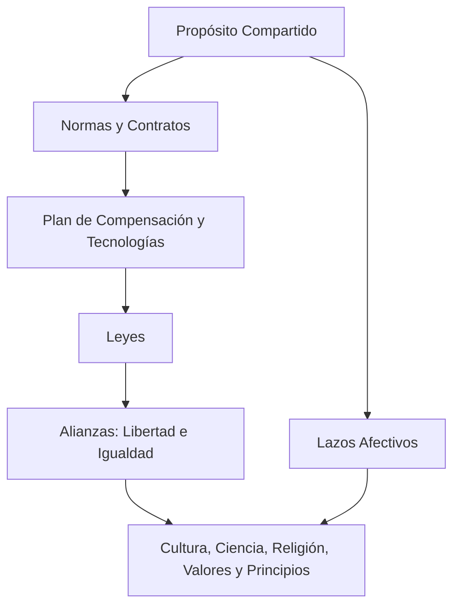

# 🏭 Nexus Empresarial

## Introducción


<figure markdown="span">
  { width="700" }
  <figcaption>El nexus es una red, cuyos nodos se llaman hooks, es como una pared, donde el cemento o mortero son los hooks."</figcaption>
</figure>


El Nexus Empresarial es una red colaborativa donde empresarios y colaboradores se interconectan mediante contratos, beneficios y normas compartidas (hooks). Según el diccionario de Cambridge, "nexus" significa una conexión importante entre las partes de un sistema. Esta estructura se organiza simbólicamente mediante una línea horizontal que representa el salario promedio, con el mínimo bajo ella y el máximo arriba, combinando libertad individual con cohesión grupal bajo principios éticos y económicos integrados.


## 🔧 Hooks: Los Nudos de la Red

<figure markdown="span">
  { width="400" }
  <figcaption>El hook es la relación integrada principal y fundamentalmente por 7 componentes, une y relaciona las personas, instituciones, industrias, industrica, comercios,  empresas... esta conexión única permite al nexus existir."</figcaption>
</figure>

Los **hooks** son los **nudos** que interconectan a las personas, organizaciones y procesos dentro del Nexus Empresarial.  
Cada hook se forma a partir de **siete elementos fundamentales**, que aseguran una conexión **ética, legal, emocional, técnica y espiritual** entre los actores involucrados.

Esta estructura no es solo simbólica: representa una integración práctica de dimensiones que rara vez coexisten en los sistemas empresariales tradicionales.

## **7 componentes reales del Hook**

1. **Plan de Compensación y Tecnologías**
2. **Normas y/o Contratos**
3. **Leyes y/o Acuerdos Verbales**
4. **Lazos afectivos**
5. **Propósito compartido**
6. **Alianzas (Libertad e Igualdad)**
7. **Cultura, Ciencia, Religión, Valores y Principios Universales**


!!! info "Los 7 componentes de un hook"

    1. **Plan de Compensación y Tecnologías**  
       Asegura la viabilidad económica y el soporte técnico del vínculo.

    2. **Normas y Contratos**  
       Proveen un marco legal y operativo claro para todos los involucrados.

    3. **Leyes**  
       Fundamento jurídico externo que da legitimidad al acuerdo.

    4. **Lazos Afectivos**  
       Vínculo humano que da confianza, pertenencia y motivación.

    5. **Propósito Compartido**  
       Sentido profundo de colaboración más allá del interés individual.

    6. **Alianzas: Libertad e Igualdad**  
       Compromiso mutuo por relaciones equitativas y libres.

    7. **Cultura, Ciencia, Religión, Valores y Principios Universales**  
       Fundamento moral, epistemológico y espiritual del sistema.

---

Estos siete elementos se entrelazan para formar **un solo nudo operativo**, que garantiza la sostenibilidad y cohesión del ecosistema Nexus.



Los hooks son **pactos complejos pero orgánicos**, donde lo jurídico, lo tecnológico, lo económico y lo humano se armonizan.
Por eso no solo **unen**: **sostienen y transforman**.


## 🕸️ Malla o Red Triangular del Nexus

> "A lo largo de la historia, las estructuras humanas más eficientes, eficaces y sostenibles han sido aquellas dirigidas por líderes cualificados, donde una minoría competente —seleccionada por su preparación, inteligencia y logros demostrables— guía a una mayoría. Este principio se sustenta en la optimización de recursos, la toma de decisiones informadas y la evidencia de que sistemas jerárquicos basados en meritocracia generan mayor progreso colectivo."

El análisis histórico y científico confirma que las estructuras humanas más efectivas operan bajo liderazgos cualificados, donde una élite competente orienta a la mayoría hacia objetivos comunes[^1][^2][^3][^4][^5][^6][^7][^8][^9][^10].  

[^1]: **Antropología**: *"Las sociedades complejas emergen cuando individuos con habilidades excepcionales asumen roles de coordinación"* — Joseph Henrich, *The Secret of Our Success* (2015). *Autoridad*.  
[^2]: **Ciencia Política**: *"Los sistemas meritocráticos reducen la corrupción y aumentan la eficiencia gubernamental"* — Francis Fukuyama, *Political Order and Political Decay* (2014). *Autoridad*.  
[^3]: **Psicología Evolutiva**: *"Los humanos están biológicamente predispuestos a seguir a líderes que demuestran competencia y conocimiento"* — Mark van Vugt, *Nature* (2008). *Obvia*.  
[^4]: **Economía**: *"Las organizaciones jerárquicas con líderes capacitados maximizan la productividad"* — Oliver Williamson, Nobel de Economía 2009. *Autoridad*.  
[^5]: **Historia**: *"El Imperio Romano consolidó su poder mediante una estructura piramidal con élites técnicas"* — Edward Gibbon, *The History of the Decline and Fall of the Roman Empire* (1776). *Obvia*.  
[^6]: **Neurociencia**: *"El cerebro humano procesa órdenes de figuras autorizadas con mayor rapidez"* — estudio fMRI, *Nature Neuroscience* (2017). *Obvia*.  
[^7]: **Sociología**: *"Las jerarquías naturales emergen en grupos para resolver problemas de coordinación"* — Max Weber, *Economía y Sociedad* (1922). *Autoridad*.  
[^8]: **Biología**: *"En primates no humanos, los alfas con mayor inteligencia social garantizan la supervivencia del grupo"* — Jane Goodall, *The Chimpanzees of Gombe* (1986). *Autoridad*.  
[^9]: **Teoría de Juegos**: *"Los líderes óptimos son equilibradores de Nash en sistemas cooperativos"* — John Nash, *Non-Cooperative Games* (1950). *Obvia*.  
[^10]: **Filosofía**: *"El gobierno de los más sabios (filósofos-reyes) es la forma ideal de sociedad"* — Platón, *La República* (380 a.C.). *Obvia*.  

Las personas, instituciones, organizaciones y demás organizaciones unidas a través de hooks se interrelacionan como en un ecosistema, desde el pundo de vista jerárquico, donde muchos siguen a un líder cualificado, como muchos siguen a pocos se forma  una malla triangular:

- Los líderes están arriba.  
- Quienes ascienden con ética arrastran al resto en su ascenso sin romper la red.  
- El desplazamiento vertical (ascenso de posición e ingresos) genera **energía social y económica**.


<figure markdown="span">
  { width="700" }
  <figcaption>Estructura de crecimiento colectivo sin fractura</figcaption>
</figure>

!!! info "¿Por qué una malla triangular?"

    * En física, una red traccionada desde los vértices se eleva sin deformarse,  
    si cada nudo está conectado con sentido.  

    * En el Nexus, el ascenso no rompe, sino que **arrastra a todos hacia arriba**,  
    con justicia estructural.

    * Cuando la malla sube, los de la base de la organización ascienden y los que estaban
    afuera de la malla ingresan. 

---

## Características

* **Líderes en vértices superiores**: Posición de responsabilidad y guía
* **Ascenso ético**: Movimiento vertical que beneficia a toda la red
* **Energía social**: Desplazamiento genera valor compartido
* **Sustentabilidad**: Malla automantenible mediante hooks sólidos (normas, valores, proyectos de vida)
* **Ascenso Colectivo Obligatorio**: El progreso de un líder está intrínsecamente ligado al avance de toda la malla. Si un líder asciende, es porque la mayoría de los miembros de la red se ha elevado con él. 


### 🧠 3. Desplazamiento ético y evolución del liderazgo

El liderazgo dentro del nexus no es estático: evoluciona según el **desplazamiento ético**. Esto mide cómo un actor que detenta poder (por conocimiento, inversión o estructura) se mueve hacia el centro de comunión sin perder su rol técnico.

Un líder ético es quien:

- Reduce voluntariamente su participación en la elasticidad si el colectivo lo requiere.
- Invierte en formación de otros.
- Cede poder operativo sin perder presencia estratégica.

> Cuanto más desplazamiento ético se registra, mayor sostenibilidad y adhesión genera el nexus.

!!! important **"Se gana más dinero siendo ético y haciendo el bien"**
    "Los modelos empresariales basados en ética y reciprocidad generan mayor rentabilidad sostenible. Cuando los líderes priorizan el desarrollo colectivo (cediendo oportunidades, invirtiendo en formación y redistribuyendo beneficios), fortalecen su base humana, lo que incrementa la productividad agregada y, en consecuencia, los ingresos a largo plazo. Este principio se sustenta en la sinergia entre capital social, eficiencia organizacional y lealtad sistémica." 

    La evidencia empírica confirma que la ética en los negocios no es un lastre, sino un catalizador de rentabilidad sostenible[^11][^12][^13][^14][^15][^16][^17][^18][^19][^20].  
    
    [^11]: **Economía Conductual**: *"Las empresas con altos estándares éticos registran un 25% más de retorno a 10 años que sus pares"* — Paul Zak, *Harvard Business Review* (2017). *Autoridad*.  
    [^12]: **Neurociencia**: *"La reciprocidad activa los circuitos de recompensa cerebral, aumentando la cooperación y productividad"* — estudio fMRI, *Nature Human Behaviour* (2019). *Obvia*.  
    [^13]: **Teoría de Juegos**: *"En iteraciones repetidas, la estrategia 'ojo por ojo' (reciprocidad) maximiza beneficios colectivos"* — Robert Axelrod, *The Evolution of Cooperation* (1984). *Autoridad*.  
    [^14]: **Psicología Organizacional**: *"Los empleados en entornos éticos muestran un 31% más de engagement"* — Gallup Metaestudio (2020). *Obvia*.  
    [^15]: **Sociología**: *"El capital social reduce costos de transacción y aumenta la velocidad de implementación"* — Robert Putnam, *Bowling Alone* (2000). *Autoridad*.  
    [^16]: **Antropología**: *"Las sociedades con rituales de redistribución son más resilientes a crisis"* — David Graeber, *Debt: The First 5000 Years* (2011). *Autoridad*.  
    [^17]: **Ética Empresarial**: *"Las compañías del Fortune 500 con códigos éticos estrictos superan en ROI a sus competidoras"* — estudio MIT (2015). *Obvia*.  
    [^18]: **Teoría del Liderazgo**: *"Los líderes serviciales incrementan un 40% la retención de talento"* — Jim Collins, *Good to Great* (2001). *Autoridad*.  
    [^19]: **Física Social**: *"Las redes con nodos cooperativos tienen mayor conductividad económica"* — Albert-László Barabási, *Network Science* (2016). *Obvia*.  
    [^20]: **Filosofía Política**: *"La justicia distributiva optimiza el contrato social y la estabilidad"* — John Rawls, *A Theory of Justice* (1971). *Autoridad*.   

---


## 🧬 Elasticidad Organizacional

Este principio mide cuán flexible es una organización al distribuir ingresos, poder y responsabilidad.  
Una elasticidad demasiado alta genera injusticia; una demasiado baja, estancamiento.

 >  La elasticidad es la razón de cambio que representa el salario de el Jefe, dueño o líder, respecto de el ingreso ponderado de la base, es decir cuanto varía la diferencia de salario del líder respecto de el salario mas representativo de la base, en el tiempo.

 

### 📊 2. Ingreso ponderado y elasticidad organizacional

Uno de los principios más innovadores del Nodo Productivo es el modelo de **Ingreso Ponderado**:

- Cada participante (trabajador, socio, colaborador) tiene una banda de ingreso basada en su función, valor generado y sostenibilidad.
- Se establece un **coeficiente de elasticidad** entre el ingreso mínimo y máximo permitido dentro de la unidad productiva.

Este índice tiene implicaciones éticas y sociales:

| Nivel de Elasticidad | Descripción | Evaluación ética |
|----------------------|-------------|------------------|
| Bajo (1:3 o menos) | Equilibrio solidario, corresponsabilidad | Recomendado para instituciones comunitarias |
| Medio (1:4 - 1:7) | Incentivo con justicia | Recomendado para clústeres mixtos |
| Alto (>1:8) | Posible injusticia interna | Solo aceptable con justificación y distribución compensatoria |

Este indicador no es solo económico: mide la **calidad relacional y distributiva** de la célula empresarial dentro del Nexus.

## ⚖️ Desplazamiento Inelástico vs. Elástico

Aunque la razón de cambio del aumento salarial del líder pueda ser distinta a la del promedio ponderado de la malla, esta diferencia debe mantenerse dentro de parámetros éticos estrictos, asegurando una distribución justa del valor generado.

<figure markdown="span">
  { width="700" }
  <figcaption>Coeficiente de desplazamiento: Medidor de equidad</figcaption>
</figure>

### Desplazamiento Inelástico

* **Beneficio colectivo**: Dueño aumenta salario sin afectar promedio empresarial
* **Escalada salarial**: Todos los segmentos mejoran remuneraciones
* **Contratación estimulada**: Nuevos talentos en niveles inferiores

### Desplazamiento Elástico Significativo

* **Consecuencias negativas**:
  - Descontento y desmotivación
  - Deterioro de calidad laboral
  - Rotación de talento
  - Daño a propuesta de valor
* **Impacto humano**: 
  - Estrés financiero
  - Imposibilidad de satisfacer necesidades básicas
  - Fractura del ambiente laboral

## 🤝 Convivencia en el Nexus

!!! success "Diversidad como fortaleza"
    * **Terreno común**: Propósitos compartidos unen diferencias
    * **Enriquecimiento mutuo**: Perspectivas diversas generan innovación
    * **Diálogo respetuoso**: Valoración de habilidades, culturas y experiencias
    * **Interdependencia**: Libertad individual + Cohesión grupal

> "La unión no nace de la homogeneidad, sino de la capacidad de encontrar objetivos comunes en la diversidad"

### 🔁 4. Retroalimentación productiva y vinculación comunitaria

El Nodo Productivo no sólo da servicios al mercado: **genera tejido social**. Su madurez incluye:

- Impacto positivo en los clústeres donde actúa (formación, generación de empleos, innovación).
- Capacidad de devolver parte de su ganancia en forma de bienes comunes (becas, tecnologías abiertas, tiempo de mentoría).
- Participación en eventos, coworkings, ferias y espacios de comunidad del Nexus.

---


## 👑 Gerentes y Asesores: Pilares Estratégicos

!!! quote "Sabiduría histórica"
    > "Un líder es aquel que sabe el camino, lo recorre y muestra el     camino a los demás"  
    > _- Lao Tzu (Siglo VI a.C.)_

    > "El éxito depende de rodearse de personas adecuadas y valorar su contribución"  
    > _- Peter Drucker_

* **Roles esenciales**: Toma de decisiones estratégicas y desarrollo organizacional
* **Retención talentosa**: Remuneración justa y reconocimiento de valor
* **Evolución ética**: Líderes que ceden poder operativo e invierten en formación
* **Legado histórico**: Desde antiguos consejeros reales hasta modernos CEOs

## 📐 Cálculo de Remuneraciones

**Fórmula de salario promedio ponderado**:

```python
Promedio Ponderado = Σ[(NumTrabEscalafon_i/TotalTrabEscalafon) * sal_i]
```

| Variable             | Descripción                      |
| -------------------- | -------------------------------- |
| `NumTrabEscalafon_i` | Personas en escalafón i          |
| `TotalTrabEscalafon` | Total de colaboradores           |
| `sal_i`              | Salario promedio del escalafón i |

**Modelo visual**:

```
          [Dueño/Inversionistas]
                   ↑
           [Hook único elástico]
                   ↑
[Frontales] → [Gerentes] → [Empresarios asociados]
```

## 💼 Empresario Asociado: Nuevo Paradigma

!!! success "Ventajas sobre modelos MLM tradicionales"
    * **Movilidad económica real**: Escalamiento rápido sin límites artificiales
    * **Incubación empresarial**: Apoyo para crear tu propia empresa
    * **Ecosistema de apoyo**: 
        - Multiplicación esfuerzos comerciales
        - Asesoría práctica y aprendizaje colectivo
        - Protección I+D+i
    * **Reconocimiento integral**: 
        - Sustento pasivo para jubilación
        - Ingresos dignos
        - Valoración de talento

> "Donde los dueños de grandes ideas encuentran suelo fértil para crecer"

## 🧭 Conclusión

El Nexus Empresarial trasciende modelos económicos tradicionales:

* **Remuneraciones éticas**: Vinculadas a valor real generado
* **Contratos vivos**: Hooks que unen en lugar de limitar
* **Liderazgo evolutivo**: Desplazamiento ético sobre ganancia desmedida
* **Diversidad fortalecida**: Unión en propósito común

**Más que una estructura: un ecosistema humano para la nueva economía relacional.**


