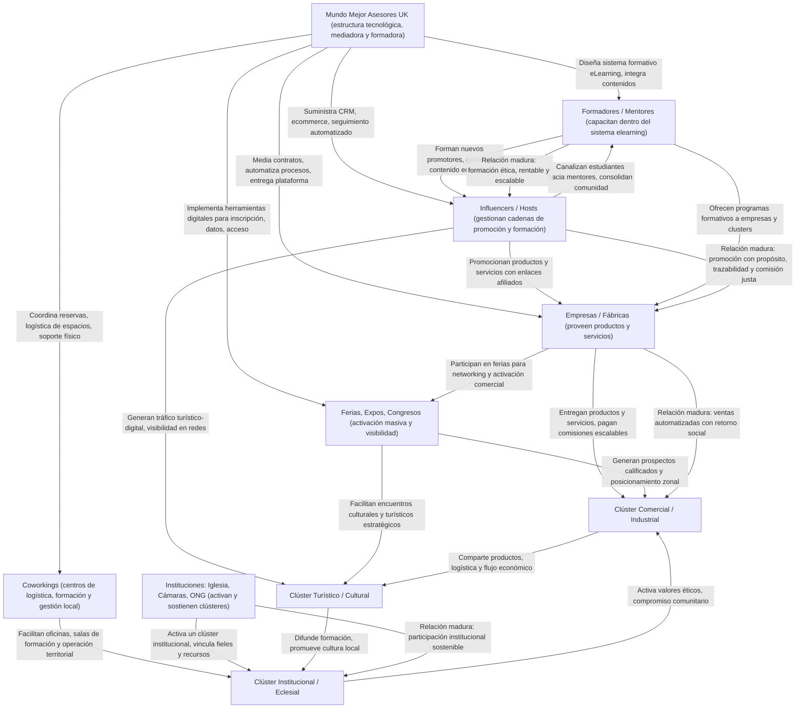

# 🕸️ Arquitectura Operativa del Nexus

El Nexus no es solo un modelo teórico, sino un ecosistema vivo de actores que colaboran para alcanzar objetivos comunes. El siguiente diagrama ilustra las relaciones funcionales y estratégicas que forman la red.

## Diagrama del Ecosistema Nexus

## Roles de los Actores Clave

El ecosistema se estructura en cuatro niveles operativos:

#### **Nivel 1: El Núcleo Mediador**

- **Mundo Mejor Asesores UK (MMA):** Es la entidad central que provee la infraestructura tecnológica, legal y formativa. Diseña las plataformas (CRM, eLearning), automatiza procesos, media contratos y establece los estándares para la creación de *hooks*.

#### **Nivel 2: Actores Estratégicos Operativos**

- **Influencers / Hosts:** Gestionan cadenas de promoción y formación. Utilizan las herramientas del Nexus (enlaces de afiliado, CRM) para promocionar productos, servicios y cursos, canalizando audiencias hacia las empresas y formadores.

- **Formadores / Mentores:** Capacitan a los demás actores dentro del sistema eLearning. Crean contenido educativo, forman nuevos promotores y ofrecen programas especializados a empresas y clústeres.

- **Empresas / Fábricas:** Proveen los productos y servicios que se comercializan en la red. Se benefician de un sistema de ventas automatizado con comisiones escalables y acceso a una comunidad comprometida.

- **Coworkings:** Actúan como centros de logística, formación y gestión local. Proporcionan el espacio físico necesario para reuniones, capacitaciones y operaciones territoriales.

- **Eventos (Ferias, Expos):** Son puntos de activación masiva y visibilidad. Generan prospectos calificados, facilitan el networking y fortalecen la presencia de los clústeres a nivel local.

#### **Nivel 3: Agentes Clusterizadores**

- **Instituciones (Iglesia, Cámaras, ONG):** Son actores clave que activan, sostienen y dan cohesión ética y comunitaria a los clústeres. Vinculan a sus miembros y recursos, aportando el capital social y moral que fortalece los *hooks*.

#### **Nivel 4: Los Clústeres**

Son las manifestaciones concretas del Nexus en el territorio, donde se agrupan los actores según su afinidad:

- **Clúster Comercial / Industrial:** Enfocado en la producción, logística y venta de bienes.

- **Clúster Turístico / Cultural:** Centrado en la promoción de servicios culturales, turísticos y de experiencias.

- **Clúster Institucional / Eclesial:** Articula la participación de comunidades de fe y organizaciones civiles, activando valores y compromiso comunitario.

## La Maduración de las Relaciones: El "Hook" Logrado

Una relación dentro del Nexus evoluciona. Comienza como una simple transacción y madura hasta convertirse en un **hook**: una comunión operativa con propósito ético, económico y social.

- **Ejemplo:** La relación entre un **Influencer** y una **Empresa** madura cuando va más allá de una comisión por venta. Se convierte en un *hook* cuando ambos comparten un propósito (ej. promover productos sostenibles), la trazabilidad es transparente y la comisión es justa y automatizada, generando un retorno de valor para toda la red.

**Explorar las Secciones**

* [**El Modelo Empresarial**](./modelo_empresarial.md)
    * Descubre en detalle los componentes del Nexus, los hooks, la malla triangular y la fórmula de Elasticidad Organizacional. Ideal para empresarios, gestores y analistas.

* [**La Arquitectura Operativa**](./arquitectura_operativa.md)
    * Visualiza cómo funciona el ecosistema en la práctica. Conoce a los actores clave, sus roles y cómo se interconectan para generar valor.

* [**Fundamentos Doctrinales y Sociales**](./Nexus-Doctrina.md)
    * Profundiza en las bases teológicas y filosóficas del Nexus, alineadas con la Doctrina Social de la Iglesia. Dirigido a instituciones religiosas y líderes comunitarios.

* [**Perspectiva Académica y Científica**](./perspectiva_academica.md)
    * Analiza los fundamentos del Nexus desde la psicología, la sociología y la economía, incluyendo la Teoría de la Autodeterminación y los efectos de red.

<!-- ## Página siguiente: 
[**Fundamentos Doctrinales y Sociales**](./Nexus-Doctrina.md){ .md-button } -->

