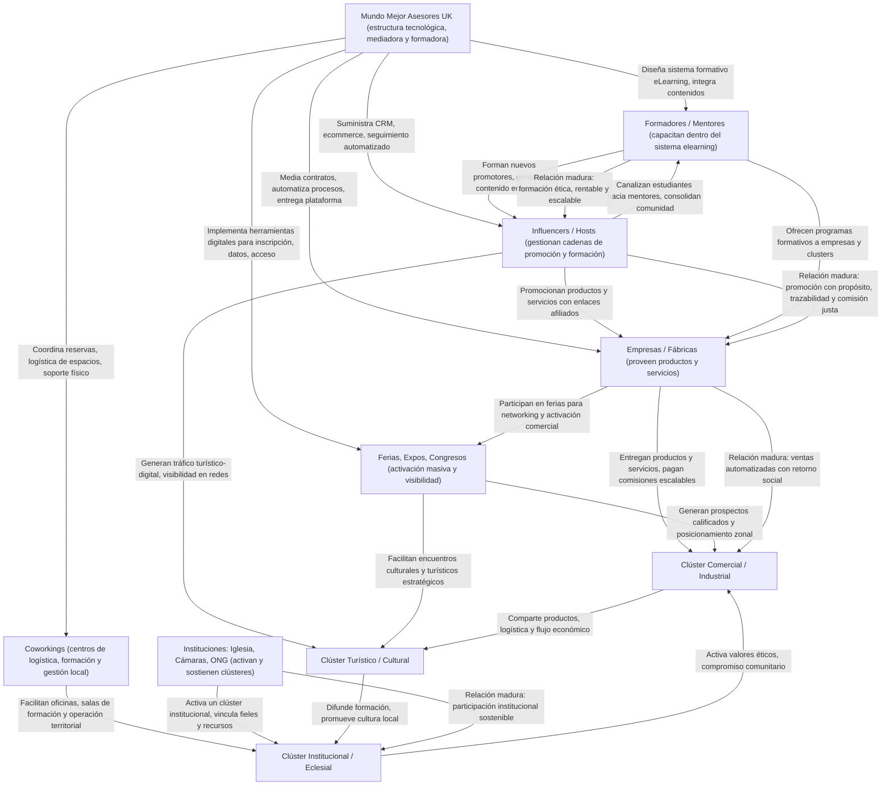

# Nexus: Arquitectura Estratégica para una Koinonía Sostenible

!!! abstract "Propósito General"
    Este documento es el eje madre que conecta y articula todos los nodos del sistema Nexus. Su propósito es presentar de manera clara, visual y narrativa la arquitectura estratégica que permite una transformación social, productiva y espiritual integral. Aquí se vinculan las dimensiones **teológicas**, **económicas**, **sociales**, **psicológicas** y **productivas** en un único sistema convergente.

---

## Índice de Secciones

1. [Doctrina del Nexus: Fundamentos Cristianos y Sociales](doctrina-nexus.md)
2. [Perspectiva Científica, Psicológica y Económica](nexus-perspectiva-psico-cientifica-economica.md)
3. [Nodo Productivo: Ecosistema Empresarial y Logístico](nodo-productivo.md)
4. [Declaración de Intención Fundacional](declaracion-de-intencion.md)

---

## Diagrama Operativo del Nexus

<figure markdown="span">
  { width="750" }
  <figcaption>Esquema de relaciones estratégicas entre los actores clave del Nexus</figcaption>
</figure>



---

## Explicación del Diagrama

!!! success "¿Qué muestra el diagrama?"  
    El esquema presenta las **relaciones funcionales y estratégicas** entre los actores del Nexus. Está estructurado en cuatro niveles:

```
- **Nivel 1:** El núcleo mediador (MMA) que provee tecnología, automatización y diseño.
- **Nivel 2:** Actores operativos que ejecutan acciones clave (influencers, mentores, empresas...).
- **Nivel 3:** Instituciones que sostienen la cohesión territorial y ética del sistema.
- **Nivel 4:** Clústeres donde se manifiestan los beneficios concretos, visibles y medibles.
```

---

## La Elasticidad del Nexus

!!! info inline end "¿Qué significa que el Nexus es elástico?"  
	La elasticidad es una metáfora física para explicar que el 		     sistema **puede crecer**, deformarse y asumir distintas     	       configuraciones **sin perder su forma ni sus principios**. En         tiempos de presión o crisis, los niveles más altos (líderes) se       reacomodan y absorben la tensión, mientras que los nuevos             ingresos en la base permiten regeneración.

---

## El Ingreso Ponderado: ¿Cómo entra la gente al sistema?

!!! tip "Sistema con movilidad vertical"  
    A diferencia de estructuras rígidas, el Nexus permite que cada actor evolucione. Un influencer puede volverse formador; una empresa puede escalar como clúster; una parroquia puede convertirse en nodo logístico. **El sistema forma desde adentro y mejora con cada interacción.**

---

## ¿Qué es un Hook?

!!! quote "Hook es comunión operativa"  
    Un **Hook** es cuando una relación entre actores deja de ser transaccional y se convierte en **comunión operativa con propósito ético**, económico y social. Ej: una empresa ya no vende, sino que produce valor junto a la comunidad.

---

## Siguiente paso

Dirígete a [Doctrina del Nexus](doctrina-nexus.md) para conocer los fundamentos cristianos y sociales de este sistema.

---


