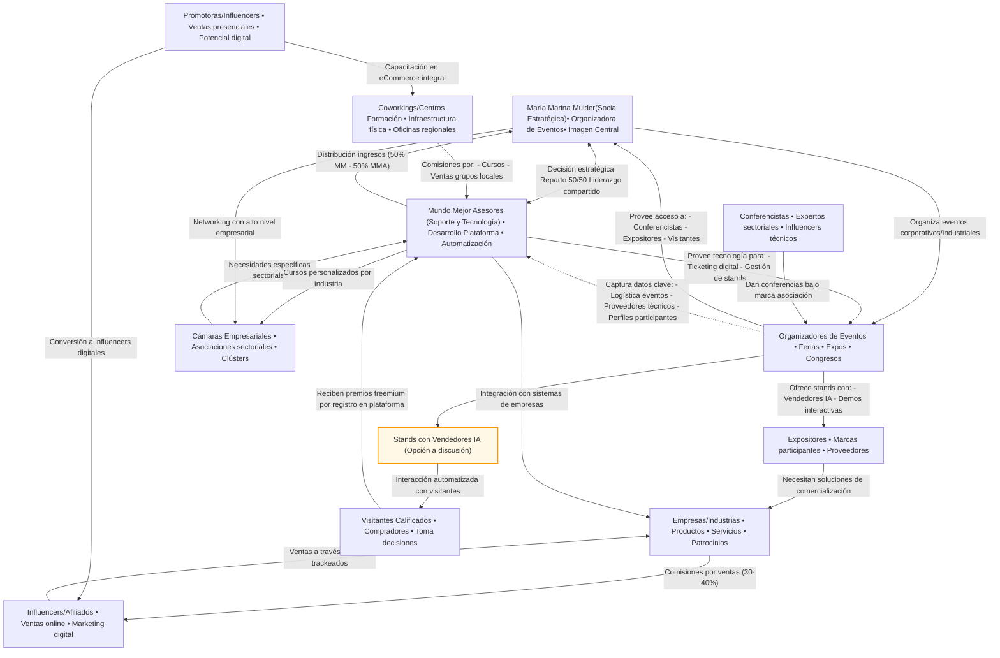

# Propuesta de Alianza Estratégica para María Marina Mulder
{ width=1080 } 
## Introducción Personalizada

Hola María Marina,

Después de nuestra reciente y enriquecedora conversación, quiero presentarte una propuesta alineada con tu visión y experiencia. Mi objetivo es establecer una alianza estratégica contigo para desarrollar un sistema innovador que permita a hosts, locutores, comunicadores e influencers monetizar su trabajo de manera mucho más rentable, eficaz y eficiente. Estoy convencido de que, sumando tu liderazgo y mi experiencia en tecnología y negocios digitales, podemos transformar el panorama actual y generar un impacto positivo y sostenible en la industria de la comunicación.

## Visión General del Sistema

El sistema que propongo busca revolucionar la venta de productos y servicios para industrias, comercios y empresas, integrando tecnología avanzada y un modelo de negocio colaborativo. La propuesta está diseñada para multiplicar la productividad y rentabilidad de los comunicadores, facilitando la monetización directa y garantizada de su trabajo, con resultados tangibles desde el inicio.

## Componentes Clave del Sistema

- **Página web individualizada:** Cada producto o servicio contará con una página web dedicada, optimizada para la conversión y la presentación detallada de sus características.

- **Inteligencia artificial para ventas:** Implementaremos IA para optimizar los procesos de venta, personalizando la experiencia del cliente y automatizando tareas repetitivas.

- **Tienda en línea y sistema de afiliados:** Una plataforma robusta que permite a influencers, locutores y comunicadores monetizar de forma inmediata y rentable, conectando directamente con fábricas y tiendas.

- **Aula virtual y formación automatizada:** Un entorno de aprendizaje digital que utiliza material de universidades e instituciones líderes, multiplicando la eficiencia del instructor y garantizando la capacitación práctica y aplicable de los participantes.

## Curso Inicial: Monetización Garantizada para Hosts, Locutores e Influencers

Como punto de partida, propongo lanzar juntos el curso **“Monetización Directa y Garantizada para Comunicadores e Influencers”**. Este curso está diseñado para que los participantes no solo adquieran conocimientos prácticos, sino que también apliquen lo aprendido de inmediato, generando ingresos a través de acuerdos directos con fábricas, tiendas y empresas. Garantizamos que cada participante pueda implementar su aprendizaje y obtener resultados económicos reales, lo que eleva el valor y atractivo del curso

**Propuesta de Ganancias:**  
Como socia estratégica, recibirás el 50% de las utilidades generadas por este curso. Esto asegura una relación equitativa y motivadora, alineada con el esfuerzo y la visibilidad que aportas.

## Modelo de Monetización 

El sistema de monetización incluye:

- Comisiones premium por ventas directas (hasta 40%)

- Royalties estratégicos y ganancias recurrentes como socia fundadora (3-5% sobre ventas de tu red)

- Descuentos exclusivos y acceso a ofertas VIP

- Ingresos pasivos por cursos automatizados ($20 - $400 por curso vendido)

- Venta de certificaciones y membresías

- Webinar es Suscripciones a contenido premium y bonos por referidos **==hasta $500 dólares por todo el contenido de por vida.==**

Los pagos son automáticos, semanales y escalables internacionalmente, con opciones de transferencia flexibles.

## **Tu Rol Estratégico, María Marina**

Tu papel es fundamental: **Socia Fundadora clave en el Desarrollo y Expansión de la Iniciativa**. El sistema está diseñado para **multiplicar la eficiencia de tu tiempo**, automatizando procesos y **permitiéndote obtener resultados significativos sin sobrecargarte**, **adaptándose a tu agenda y maximizando tu rentabilidad**.

## Primeros Pasos y Tácticas  de Trabajo Conjunto

1. - [x] Canal de formación en tu página personalizada. (==esta página==).  (Terminado) (Daniel)

2. - [ ] Creación de usuario y prueba de la plataforma. (En proceso) (Daniel)

3. - [ ] Manual corto y didáctico para facilitar tu experiencia. (En proceso) (Daniel)

4. - [ ] Organización de tácticas y estrategias de expansión, aprovechando tu red de contactos y tu experiencia en comunicación (En espera) (**==Propuesta a Maria Marina, próxima reunión==**. )

## **Primer Paso Propuesto**: Escuela de Promotores, Influencers Hosts y Organización de Eventos

1. Te Propongo crear juntos la **Escuela de Influencers** como ==primer paso==, donde tu imagen y liderazgo serán el motor para atraer y capacitar a nuevos talentos. Además, tu rol actual como host de eventos, permite atacar eficazmente el medio publicitario, tanto para  ==**aspirantes (Promotoras, participantes de certámenes, cantantes, otros influencers...)**==, como para experimentados en las Artes Gráficas, Publicidad y Medios (GPM). Esta creo que es la ruta mas corta para ampliar aún mas tu marca y a futuro te permitirá asumir el rol de  organizadora de Eventos Nacionales, Comerciales, Industriales y Corporativos (incluso turísticos) en asociación conmigo.

  
# Resumen Ejecutivo del Plan Marco

## Ecosistema de Monetización, Formación y Eventos para Comunicadores e Influencers

---

!!! abstract "Visión Global"  

La propuesta es construir un ecosistema digital y presencial donde comunicadores, influencers, locutores y organizadores de eventos puedan monetizar su talento y contactos de manera eficiente, escalable y sostenible.  

El sistema se apoya en tecnología avanzada, alianzas estratégicas y una estructura de ingresos diversificada, con la marca **María Marina Mulder como socia central y Mundo Mejor Asesores (MMA) como socio tecnológico y operativo**.

---

## Participantes Clave y Roles

- **María Marina Mulder:** Socia estratégica, imagen central, tomadora de decisiones, líder de formación y eventos.

- **Mundo Mejor Asesores (MMA):** Desarrollo tecnológico, tomador de decisiones, soporte, administración de la plataforma y datos.
- **Plataforma digital única en su tipo** Soporta de manera cada vez mas activa e inteligente procesos de ventas, atención al cliente, inscripciones en línea, clases, exámenes... todo lo necesario para multiplicar los esfuerzos de los participantes, optimizando resultados.

- **Coworkings y Centros de Formación:** Aliados subordinados; ofrecen espacios, promueven cursos y reciben un porcentaje de ingresos y royalties.

- **Organizadores de Eventos (Expos, Ferias):** Subordinados a la alianza; promueven el sistema, captan leads y reciben comisiones/royalties por su participación.

- **Empresas, Fábricas, Tiendas:** Proveen productos y servicios; patrocinan eventos, ofrecen oportunidades de monetización directa.

- **Comunicadores, Influencers, Hosts, Locutores:** Usuarios activos; toman cursos, venden productos, generan ingresos y expanden la red.

- **Participantes de Cursos y Público General:** Aprenden, aplican conocimientos y generan ingresos inmediatos.

---

## Componentes y Procesos Clave 
## ==(Presiona ++ctrl+plus++)== para ampliar el gráfico

---

## Modelo de Monetización ==Basado en los Procesos==.

!!! success "Fuentes de Ingresos, Distribución y Flujos de Valor"

El sistema de monetización está diseñado para maximizar el beneficio de cada participante, asegurando transparencia, escalabilidad y un reparto justo según el valor y la función de cada actor. A continuación, se detallan las fuentes de ingresos, la distribución y los flujos clave, enlazando cada punto con los procesos y actores del diagrama revisado:

---

## 1. **Cursos Digitales y Formación Continua**

- **Ingresos:**
  
  - Cada curso vendido genera ingresos distribuidos así:
    
    - **50% para María Marina Mulder** (socia estratégica, imagen y promotora central).
    
    - **50% para MMA** (socio tecnológico, soporte y operación).
    
    - **Coworkings y organizadores** reciben un porcentaje adicional como comisión o royalty por cada participante que inscriban o por la infraestructura que faciliten.

- **Flujo:**
  
  - *Coworkings y centros de formación* proporcionan espacios, infraestructura y atención presencial para cursos, talleres y capacitaciones.
  
  - *Participantes* pagan inscripción, usan instalaciones y pueden convertirse en nuevos influencers o clientes de empresas.
  
  - *Influencers y promotoras* forman grupos, generan ventas y retroalimentan el sistema con nuevas ideas y necesidades.

- **Valor añadido:**
  
  - Los cursos están diseñados para que los participantes moneticen de inmediato lo aprendido, generando ingresos reales y medibles, y para que los coworkings desarrollen comunidades locales de venta y formación.

---

## 2. **Eventos, Expos y Ferias**

- **Ingresos:**
  
  - Por cada venta de entrada, stand, patrocinio, lead generado o inscripción:
    
    - **Organizadores de eventos** reciben un porcentaje de cada venta, stand vendido o lead captado.
    
    - **Coworkings** pueden recibir comisiones si facilitan espacios o captan participantes.
    
    - **María Marina y MMA** comparten utilidades netas (50/50).

- **Flujo:**
  
  - *Organizadores* convocan conferencistas, expositores y visitantes, facilitando el acceso y la promoción de productos y servicios del ecosistema.
  
  - *Conferencistas* (incluyendo María Marina y tú) imparten charlas y talleres bajo la marca de la asociación, generando confianza y acceso directo a empresarios y expositores.
  
  - *Expositores* reciben propuestas de servicios y productos, y pueden integrarse al sistema de afiliación.
  
  - *Promotoras* se identifican y capacitan para potenciar su transición a influencers digitales y vendedoras online.
  
  - *Visitantes y empresarios* reciben premios freemium por registrarse, lo que incentiva su entrada al sistema y la captación de datos valiosos para networking.

- **Valor añadido:**
  
  - El acceso a datos y contactos no es inmediato ni total, pero la experiencia en el evento permite identificar actores clave (proveedores, organizadores, empresarios, promotoras), entender la logística y construir relaciones estratégicas para futuras acciones y organización propia de eventos industriales y corporativos.

- **Opción a discusión:**
  
  - Venta de stands con vendedores de IA para interacción automatizada con visitantes (propuesta opcional).

---

## 3. **Afiliados, Ventas Directas y Ecommerce**

- **Ingresos:**
  
  - **Influencers, comunicadores, hosts y locutores** reciben comisiones premium por ventas directas (hasta 40%) y por referidos.
  
  - **Coworkings y organizadores** reciben ingresos por ventas generadas por sus propios grupos de influencers.
  
  - **Empresas, industrias y comercios** pagan comisiones y premios por ventas realizadas a través del sistema.

- **Flujo:**
  
  - *Influencers y promotoras* venden productos y servicios directamente a su audiencia, usando las herramientas tecnológicas y de soporte proporcionadas por MMA.
  
  - *Empresas, industrias y comercios* ofrecen productos, servicios y patrocinios, obteniendo ventas y promoción directa.
  
  - *Coworkings* y *organizadores* impulsan la formación de grupos de venta y reciben ingresos recurrentes.

- **Valor añadido:**
  
  - El sistema de afiliados es transparente y automatizado, con pagos semanales y escalabilidad internacional. Las industrias, comercios y empresas son el motor del sistema, ya que de sus productos y servicios comercializables provienen las principales ganancias por ventas a través de enlaces y ecommerce.

---

## 4. **Datos, Networking y Experiencia en Eventos**

- **Ingresos y valor indirecto:**
  
  - La información valiosa se obtiene principalmente a través de la experiencia y el networking en los eventos:
    
    - Identificación de organizadores, proveedores, conferencistas, expositores y promotoras.
    
    - Conexión directa con empresarios y toma de decisiones durante conferencias y actividades.
    
    - Captación de datos de contacto de quienes se registran para premios freemium o participan en dinámicas.

- **Flujo:**
  
  - *MMA y María Marina* utilizan estos contactos y aprendizajes para mejorar la oferta, segmentar mercados y planificar la organización de futuros eventos propios.
  
  - *No se depende de la entrega directa de bases de datos por parte de los organizadores*, sino del acceso estratégico y la construcción de relaciones.

- **Valor añadido:**
  
  - El ecosistema se retroalimenta y evoluciona, mejorando la experiencia y la rentabilidad para todos los actores involucrados, y permitiendo la expansión hacia la organización de eventos industriales y corporativos propios.

---

## 5. **Otros Ingresos y Bonificaciones**

- **Cursos automatizados, contenido premium, certificaciones:**
  
  - Ingresos pasivos por formación digital, suscripciones a material exclusivo, venta de diplomas y membresías.

- **Red de referidos y construcción de equipo:**
  
  - Bonos por crecimiento de la red y ventas generadas por afiliados secundarios.

- **Premios y descuentos exclusivos:**
  
  - Incentivos adicionales para los mejores vendedores e influencers.

---

!!! info "Resumen de Beneficios para Cada Actor"  
- **María Marina Mulder y MMA:** Socios centrales, comparten utilidades, liderazgo y toma de decisiones.  
- **Coworkings y centros de formación:** Proveen infraestructura y captan participantes, reciben comisiones y royalties por cursos y ventas.  
- **Organizadores de eventos:** Organizan y promueven eventos, reciben royalties y comisiones por cada venta, stand o inscripción.  
- **Empresas, industrias y comercios:** Ofrecen productos/servicios, pagan comisiones y obtienen ventas y promoción directa.  
- **Influencers, comunicadores y promotoras:** Motor de ventas y formación, reciben formación, soporte, visibilidad y comisiones premium.  
- **Participantes de cursos:** Se capacitan, aplican lo aprendido y generan ingresos inmediatos.  
- **Conferencistas, expositores y visitantes:** Se integran al sistema a través de eventos, conferencias y premios freemium.

---

## Estrategia de Lanzamiento

1. **Curso Piloto:**  
   “Monetización Directa y Garantizada para Comunicadores e Influencers”
   
   - María Marina y MMA comparten utilidades (50/50).
   
   - Coworkings y organizadores reciben royalties por cada participante captado.
   
   - Participantes aplican lo aprendido y generan ingresos inmediatos.

2. **Eventos Aliados:**  
   Participación como conferencistas y organizadores en ferias y expos (Larafest, ExpoGPM, etc.) para visibilizar la marca, captar leads, identificar actores clave y demostrar el sistema en acción.

3. **Escuela de Influencers:**  
   Formación continua y captación de nuevos talentos, con María Marina como imagen y líder.

4. **Captura de Datos y Networking Estratégico:**  
   Todos los eventos y cursos alimentan una base de datos robusta y una red de contactos de valor, a través de interacción directa y premios freemium.

5. **Evento Central Anual:**  
   Gran vitrina de marketing y networking, reuniendo a todos los aliados, empresas y participantes del ecosistema, y posicionando a María Marina y MMA como organizadores de referencia.

---

!!! warning "Tu rol es estratégico"  
María Marina, tu liderazgo y red de contactos serán el motor de este ecosistema. La tecnología y el equipo de MMA están listos para automatizar, escalar y multiplicar tu impacto, sin sobrecargarte de trabajo operativo.

!!! tip "Próximos pasos sugeridos"  

- Validar el plan marco y ajustar detalles de participación (Reunión Táctica).
  
- Contactar los coworkings, y centros de capacitación realizar las alianzas (Daniel, con confirmación de María)
  
- Preparar el curso inicial, guiones, primeros videos y materiales didácticos de las aulas (Daniel, María solo video promocional, de motivación y presencia en una o dos clases presenciales o foros... porque las clases pueden ser videos reciclables.)
  
- Lanzar el curso piloto y captar los primeros promotores aliados.
  
- Participar como conferencistas y organizadores en el próximo evento/expo para posicionar la marca y captar empresas (Daniel).
  
- multiplicar los productos comercializados en el eComerce.
  
- Fortalecer la fuerza de ventas por afiliación
  
- Medir resultados, ajustar y escalar el modelo .
