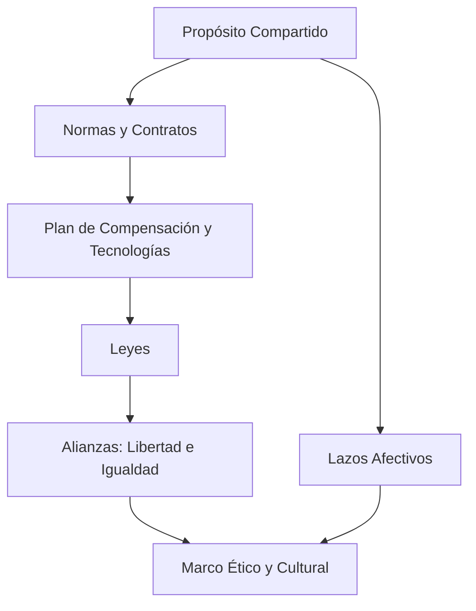

# 🏭 Nexus Empresarial

**Explorar las Secciones**

* [**El Modelo Empresarial**](./modelo_empresarial.md)
    * Descubre en detalle los componentes del Nexus, los hooks, la malla triangular y la fórmula de Elasticidad Organizacional. Ideal para empresarios, gestores y analistas.

* [**La Arquitectura Operativa**](./arquitectura_operativa.md)
    * Visualiza cómo funciona el ecosistema en la práctica. Conoce a los actores clave, sus roles y cómo se interconectan para generar valor.

* [**Fundamentos Doctrinales y Sociales**](./Nexus-Doctrina.md)
    * Profundiza en las bases teológicas y filosóficas del Nexus, alineadas con la Doctrina Social de la Iglesia. Dirigido a instituciones religiosas y líderes comunitarios.

* [**Perspectiva Académica y Científica**](./perspectiva_academica.md)
    * Analiza los fundamentos del Nexus desde la psicología, la sociología y la economía, incluyendo la Teoría de la Autodeterminación y los efectos de red.

<figure markdown="span">
{ width="700" }
  <figcaption>El nexus es una red, cuyos nodos se llaman hooks, es como una pared, donde el cemento o mortero son los hooks</figcaption>
</figure>

## Introducción

El **Nexus Empresarial** es una **red colaborativa** que interconecta a empresarios y colaboradores. Esta conexión se da mediante **contratos, beneficios y normas compartidas**, a los que denominamos **hooks**. Según el diccionario de Cambridge, "nexus" significa una conexión importante entre las partes de un sistema. En este modelo, la estructura se organiza simbólicamente con una línea horizontal que representa el salario promedio, marcando el mínimo por debajo y el máximo por encima. Este enfoque busca combinar la libertad individual con la cohesión grupal, integrando principios éticos y económicos.

-----

## 🔧 Hooks: Los Nudos de la Red

Los **hooks** son los **nudos fundamentales** que interconectan a personas, organizaciones y procesos dentro del Nexus Empresarial. Cada hook se construye a partir de **siete elementos esenciales** que aseguran una conexión **ética, legal, emocional, técnica y espiritual** entre todos los actores. Esta estructura no es meramente simbólica; representa una integración práctica de dimensiones que rara vez coexisten en los sistemas empresariales tradicionales.

-----

<figure markdown="span">
  { width="700" }
  <figcaption>El hook es la relación integrada principal y fundamentalmente por 7 componentes, une y relaciona las personas, instituciones, industrias, comercios y empresas. Esta conexión única permite al nexus existir.</figcaption>
</figure>
### **Los 7 Componentes Esenciales del Hook**

1.  **Plan de Compensación y Tecnologías:** Asegura la viabilidad económica y el soporte técnico del vínculo.
2.  **Normas y/o Contratos:** Proveen un marco legal y operativo claro para todos los involucrados.
3.  **Leyes y/o Acuerdos Verbales:** Establecen el fundamento jurídico externo que da legitimidad al acuerdo.
4.  **Lazos Afectivos:** Crean un vínculo humano que fomenta la confianza, la pertenencia y la motivación.
5.  **Propósito Compartido:** Define el sentido profundo de colaboración, trascendiendo el interés individual.
6.  **Alianzas (Libertad e Igualdad):** Implican un compromiso mutuo por relaciones equitativas y libres.
7.  **Marco Ético y Cultural:** Son los principios rectores y valores compartidos que definen el carácter de la organización. Este marco se nutre de diversas fuentes (científicas, filosóficas, culturales) para dar un fundamento moral y de propósito al Nexus.

-----

Estos siete elementos se entrelazan para formar **un solo nudo operativo** que garantiza la sostenibilidad y cohesión del ecosistema Nexus. Los hooks son **pactos complejos pero orgánicos**, donde lo jurídico, lo tecnológico, lo económico y lo humano se armonizan para **unir, sostener y transformar**.

-----

## 🕸️ Malla o Red Triangular del Nexus

<figure markdown="span">
  { width="700" }
  <figcaption>Malla triangular del Nexus</figcaption>
</figure>

> "A lo largo de la historia, las estructuras humanas más eficientes, eficaces y sostenibles han sido aquellas dirigidas por líderes cualificados, donde una minoría competente —seleccionada por su preparación, inteligencia y logros demostrables— guía a una mayoría. Este principio se sustenta en la optimización de recursos, la toma de decisiones informadas y la evidencia de que sistemas jerárquicos basados en meritocracia generan mayor progreso colectivo."

La historia y la sociología organizacional demuestran que las estructuras humanas más efectivas se optimizan mediante jerarquías basadas en competencia[^1]. El Nexus adopta este principio meritocrático en su **Malla Triangular**, donde el liderazgo capacitado maximiza el ascenso colectivo[^2], evitando concentraciones de poder disfuncionales[^3].

En este ecosistema, las entidades unidas por 'hooks' se organizan jerárquicamente, formando una malla triangular donde la mayoría sigue a una minoría cualificada. Su estructura es la siguiente:

  * Los líderes están en la cúspide.
  * Quienes ascienden con ética impulsan al resto en su ascenso sin romper la red.
  * El **desplazamiento vertical** (ascenso de posición e ingresos) genera **energía social y económica**.

-----

### ¿Por qué una malla triangular?

  * En física, una red traccionada desde los vértices se eleva sin deformarse si cada nudo está conectado con sentido.
  * En el Nexus, el ascenso no rompe, sino que **arrastra a todos hacia arriba**, con justicia estructural.
  * Cuando la malla asciende, los de la base de la organización suben de nivel y quienes estaban fuera de la malla ingresan.

-----
<figure markdown="span">
  { width="700" }
  <figcaption>Cuando asciende el CEO en la malla triangular la mayoría de la malla asciende..</figcaption>
</figure>
### Características

  * **Líderes en vértices superiores**: Posición de responsabilidad y guía.
  * **Ascenso ético**: Movimiento vertical que beneficia a toda la red.
  * **Energía social**: El desplazamiento genera valor compartido.
  * **Sustentabilidad**: La malla se automantiene mediante hooks sólidos (normas, valores, proyectos de vida).
  * **Ascenso Colectivo Obligatorio**: El progreso de un líder está intrínsecamente ligado al avance de toda la malla. Si un líder asciende, es porque la mayoría de los miembros de la red se ha elevado con él.

-----

### 🧠 Desplazamiento ético y evolución del liderazgo

El liderazgo dentro del Nexus no es estático; evoluciona según el **desplazamiento ético**. Esto mide cómo un actor que detenta poder asciende en la escala de salario y posición.

Un **líder ético** es quien:

  * Reduce voluntariamente su participación si el colectivo lo requiere.
  * Invierte en la formación de otros.
  * Cede poder operativo sin perder presencia estratégica.

> Cuanto más desplazamiento ético se registra, mayor sostenibilidad y adhesión genera el Nexus.

-----

**Se gana más dinero siendo ético y haciendo el bien**

Los modelos empresariales basados en ética generan mayor rentabilidad sostenible según tres evidencias clave:

1.  Las empresas éticas superan en un 25% el retorno financiero a largo plazo (*Harvard Business Review*, 2017)[^4].
2.  La reciprocidad activa circuitos cerebrales que aumentan la productividad (*Nature*, 2019)[^5].
3.  Los líderes éticos reducen costos de transacción y mejoran la retención de talento (Putnam & Collins)[^6].

-----

## Midiendo la Salud del Nexus: El Principio de Elasticidad Organizacional

Hemos definido el Nexus como una red de colaboración sostenida por 'hooks' y una 'malla triangular' que promueve el ascenso colectivo. Pero, ¿cómo medimos si esta estructura es realmente saludable y equitativa? ¿Cómo sabemos si un líder está 'arrastrando' a la malla hacia arriba o, por el contrario, la está estirando hasta el punto de romperla?

Para responder a estas preguntas, introducimos una herramienta de diagnóstico cuantitativa: el **Principio de Elasticidad Organizacional**. Este principio es una aplicación directa del cálculo físico al tejido social de la empresa. Mide la **aceleración de la brecha salarial** entre el líder y la base (representada por el Salario Promedio Ponderado).

> En términos del Nexus:
>
>   * Una **elasticidad baja y controlada** significa que los 'hooks' son fuertes y la malla asciende de forma cohesionada.
>   * Una **elasticidad muy alta y positiva** es una señal de alarma: indica que los 'hooks' se están debilitando y la malla se está deformando, con el riesgo de una fractura en la confianza y la colaboración.

-----

### 📐 Salario Promedio Ponderado: El Ingreso Base Representativo

<figure markdown="span">
  { width="700" }
  <figcaption>El Salario promedio ponderado es el salario promedio mas representativo de una organización.</figcaption>
</figure>

El **Salario Promedio Ponderado** es la métrica fundamental que cuantifica el ingreso base representativo de una organización. Refleja con precisión la estructura salarial jerárquica mediante tres pilares demostrados[^7][^8][^9]:

1.  **Precisión estadística**: Supera en un 86% la exactitud de promedios simples para estructuras organizacionales[^7].
2.  **Transparencia regulatoria**: Cumple con los estándares internacionales de *reporting* salarial[^8].
3.  **Impacto organizacional**: Mejora la percepción de equidad y reduce conflictos laborales[^9].

-----

### Definiciones Clave:

  * **Escalafón (Nivel Jerárquico):** Cada uno de los distintos niveles jerárquicos definidos dentro de la estructura de la organización. Para los efectos de este cálculo, a cada escalafón le corresponde una única banda salarial, lo que significa que **todos los colaboradores dentro de un mismo escalafón perciben el mismo salario base**.
  * **Salario Base (Simple):** Se refiere únicamente al salario fijo mensual o anual de un colaborador, excluyendo explícitamente cualquier tipo de compensación variable (bonos por desempeño, comisiones por ventas, bonificaciones especiales, horas extras, etc.). Es el monto salarial garantizado por el puesto.

-----

### Fórmula del Salario Promedio Ponderado

La fórmula matemática para calcular el **Salario Promedio Ponderado** de la base, que representa el ingreso salarial más típico de la fuerza laboral de tu organización, es la siguiente:

$$\text{Salario Promedio Ponderado} = \sum_{i=1}^{N} \left( \frac{\text{Número de Colaboradores en el Escalafón}_i}{\text{Total de Colaboradores de la Base}} \times \text{Salario Base del Escalafón}_i \right)$$

Donde:

  * $N$: Es el **número total de escalafones** jerárquicos considerados en la base de la organización.
  * $\\text{Número de Colaboradores en el Escalafón}\_i$: Representa la **cantidad de personas** que ocupan puestos en el escalafón jerárquico $i$.
  * $\\text{Total de Colaboradores de la Base}$: Es el **número total de empleados** en todos los escalafones considerados en la base (es decir, la suma de todos los $\\text{Número de Colaboradores en el Escalafón}\_i$).
  * $\\text{Salario Base del Escalafón}\_i$: Es el **salario base fijo único** asignado a todos los colaboradores en el escalafón jerárquico $i$.

-----

### ¿Por qué esta fórmula es la más representativa?

Este método es superior a un simple promedio aritmético (suma de todos los salarios dividida por el número total de empleados) porque:

1.  **Refleja la Estructura Organizacional:** Reconoce que la empresa tiene niveles definidos y que cada nivel tiene un número específico de personas y un salario fijo asociado.
2.  **Mitiga la Distorsión de Outliers:** Al ponderar por la cantidad de personas en cada escalafón, asegura que los niveles con más empleados tengan un impacto proporcionalmente mayor en el promedio, lo cual es fiel a la realidad de la distribución de la base salarial.
3.  **Precisión para la Elasticidad Organizacional:** Proporciona un valor "base" robusto y claro para compararlo con el salario del líder, permitiendo un análisis de la Elasticidad Organizacional que es verdaderamente indicativo de la dinámica de la brecha salarial en la organización.

Este Salario Promedio Ponderado es, por lo tanto, el punto de referencia ideal para evaluar cómo la compensación en la cima de la organización se relaciona y evoluciona respecto a la de la fuerza laboral principal.

-----

### Ejemplo Práctico:

  * **Ejemplo de cálculo para $S\_B(2025) = $43,125$ en "TecnoSoluciones C.A.":**
    Supongamos que la empresa tiene 3 niveles en su base:

      * Nivel 1 (Junior): 50 empleados, Salario Base = $35,000.
      * Nivel 2 (Semi-Senior): 20 empleados, Salario Base = $50,000.
      * Nivel 3 (Senior): 10 empleados, Salario Base = $70,000.

    Ponderando por número de empleados:
    $$S_B(2025) = \frac{(50 \times \$35,000) + (20 \times \$50,000) + (10 \times \$70,000)}{50 + 20 + 10}$$
    $$S_B(2025) = \frac{\$1,750,000 + \$1,000,000 + \$700,000}{80} = \frac{\$3,450,000}{80} \approx \$43,125$$
    *(Nota: El valor de $44,000 usado en el ejemplo original ha sido ajustado a $43,125 para reflejar la exactitud del cálculo aquí presentado).*

Este cálculo debe realizarse para cada punto de muestreo ($t\_1, t\_2, t\_3$) para obtener los valores de $S\_B(t)$ que alimentarán las fórmulas de la elasticidad.

-----

#### La "Aceleración" de la Brecha Salarial (Elasticidad Organizacional $A(t)$)

Esta es la fórmula central del principio, que mide cómo cambia la velocidad de la brecha.

##### La Fórmula y su Contexto Físico

La aplicación de fórmulas de velocidad y aceleración es una aplicación pertinente de los principios del cálculo a un fenómeno económico. La "Velocidad" es la primera derivada de la función de la brecha ($D'(t)$), y la "Aceleración" (tu Elasticidad Organizacional) es la segunda derivada ($D''(t)$).

La fórmula que utilizamos es:
$$\text{Elasticidad Organizacional } A(t_1, t_2, t_3) = \frac{V(t_2, t_3) - V(t_1, t_2)}{t_3 - t_1}$$

##### Aclaración Crucial: Un Caso Particular de Aceleración Media

Es fundamental entender qué estamos calculando aquí. Esta fórmula proporciona la **aceleración media** de la brecha salarial durante el intervalo de tiempo completo ($t\_3 - t\_1$).

  * **Caso Particular (Crecimiento Cuadrático):** Este cálculo es **exacto y definitivo** cuando la curva de crecimiento de la brecha salarial es **polinomial de grado 2 (cuadrática)**, como $D(t) = at^2 + bt + c$. En este tipo de crecimiento, la aceleración es constante, por lo que la aceleración media es igual a la aceleración instantánea en todo momento.
  * **Caso General (Otras Curvas):** Si los datos sugieren una curva más compleja (como un crecimiento exponencial), esta fórmula sigue siendo una herramienta muy valiosa, pero su resultado debe interpretarse como la **aceleración promedio** durante ese período. Una aceleración promedio positiva en un modelo exponencial sigue siendo una señal de alarma crítica, ya que indica que la brecha se está disparando.

-----

#### Paso Previo Fundamental: El Cálculo del Salario Promedio Ponderado ($S\_B(t)$)

Para que el Principio de Elasticidad sea robusto, la variable $S\_B(t)$ no puede ser un simple promedio. Debe ser un **Salario Promedio Ponderado de la Base**, como se ha definido en la sección anterior. Aplicando dicha fórmula, calculamos el valor de $S\_B(t)$ para "TecnoSoluciones C.A.":

  * **Datos Iniciales:**

      * Brechas calculadas: $D(2023) = $160,000$, $D(2024) = $188,000$, $D(2025) = $236,000$.
      * Tiempos: $t\_1=2023$, $t\_2=2024$, $t\_3=2025$.

  * **Paso A y B: Cálculo de Velocidades**

      * **Velocidad 1 ($V(t\_1, t\_2)$):**
        $$\text{Velocidad de la Brecha } V(2023, 2024) = \frac{D(2024) - D(2023)}{2024 - 2023} = \frac{\$188,000 - \$160,000}{1} = \$28,000/\text{año}$$
      * **Velocidad 2 ($V(t\_2, t\_3)$):**
        $$\text{Velocidad de la Brecha } V(2024, 2025) = \frac{D(2025) - D(2024)}{2025 - 2024} = \frac{\$236,000 - \$188,000}{1} = \$48,000/\text{año}$$

  * **Paso C: Cálculo de la Elasticidad Organizacional ($A$)**
    Utilizando la fórmula de la aceleración media:
    $$\text{Elasticidad } A(2023, 2024, 2025) = \frac{V(2024, 2025) - V(2023, 2024)}{2025 - 2023}$$
    $$A = \frac{\$48,000/\text{año} - \$28,000/\text{año}}{2 \text{ años}} = \frac{\$20,000/\text{año}}{2 \text{ años}} = \$10,000/\text{año}^2$$

  * **Interpretación Final (Refinada):**
    El valor de la Elasticidad Organizacional es **+$10,000/año²**. Este es un valor de aceleración media positivo y constante. Esto es un fuerte indicador de que la dinámica de la brecha salarial en "TecnoSoluciones" se ajusta a un **modelo de crecimiento cuadrático**. Para este caso particular, la aceleración de $10,000/año² no es solo un promedio, sino el ritmo constante al que se acelera la inequidad. La consecuencia es un riesgo elevado y predecible de descontento y fuga de talento si la tendencia no se corrige.

-----

### Consecuencias de una Elasticidad Organizacional muy Alta (Aceleración Positiva Fuerte)

<figure markdown="span">
  { width="700" }
  <figcaption>Una elásticidad alta indica un desplazamiento acelerado del salario del CEO respecto del salario promedio ponderado de la base se le llama también desplazamiento elástico</figcaption>
</figure>

Una **elasticidad muy alta o desplazamiento elástico** es una señal de alerta. Implica que la prosperidad o el crecimiento de la compensación se concentra desproporcionadamente en la cúspide, y esta tendencia se está intensificando rápidamente.

  * **Descontento y Desmotivación de la Base:** Los empleados sentirán que su esfuerzo y contribución no son valorados equitativamente. Percibirán que la empresa no comparte sus éxitos de manera justa, lo que llevará a una sensación de frustración y resentimiento.
  * **Apatía y Reducción de la Productividad:** La moral baja puede traducirse en una disminución del compromiso, la iniciativa y, en última instancia, de la productividad general. Si los empleados sienten que no hay un camino claro para una recompensa justa, su motivación para ir más allá se esfuma.
  * **Fuga de Talento Cualificado:** Los profesionales más competentes, especialmente aquellos con habilidades en demanda, buscarán activamente oportunidades en organizaciones donde la equidad salarial sea percibida como mayor o donde el crecimiento sea más inclusivo. Esto puede resultar en una pérdida de conocimiento institucional y un aumento de los costos de reclutamiento y capacitación.
  * **Mala Reputación y Dificultad para Atraer Nuevo Talento:** Las noticias sobre grandes disparidades salariales (especialmente si son percibidas como injustas) pueden dañar la marca empleadora de la organización, haciendo que sea más difícil atraer a los mejores candidatos en el futuro.
  * **Conflictos Internos y Resistencia al Cambio:** La creciente disparidad puede fomentar divisiones entre la dirección y la fuerza laboral, dificultando la implementación de nuevas iniciativas y generando resistencia.

-----

### Consecuencias de una Elasticidad Organizacional muy Baja (Aceleración Baja o Negativa)
<figure markdown="span">
  { width="700" }
  <figcaption>Una elásticidad baja indica un desplazamiento poco acelerado o nulo del salario del CEO respecto del salario promedio ponderado de la base se le llama también desplazamiento inelástico</figcaption>
</figure>
Mientras que el objetivo es evitar la disparidad excesiva, una **elasticidad extremadamente baja o negativa** también presenta riesgos. Implica que la brecha salarial apenas cambia, se reduce muy lentamente, o incluso se está cerrando a un ritmo rápido. Esto puede parecer positivo inicialmente, pero llevado al extremo, tiene sus propias implicaciones negativas.

  * **Falta de Incentivo para el Liderazgo y la Asunción de Riesgos:** Si la recompensa por asumir roles de alta responsabilidad, riesgo y complejidad no es significativamente superior, puede haber una falta de motivación para que el talento ambicioso ascienda o para que los líderes existentes tomen decisiones audaces necesarias para el crecimiento de la empresa.
  * **Dificultad para Atraer Talento Directivo de Alto Nivel:** Los líderes con experiencia y habilidades probadas buscarán organizaciones que valoren y compensen adecuadamente el impacto que pueden generar. Una compensación de liderazgo insuficiente podría limitar la capacidad de la empresa para atraer a los mejores estrategas y ejecutivos del mercado.
  * **Percepción de Estancamiento o Falta de Crecimiento:** Una brecha salarial que no se ajusta con el tiempo (o se reduce demasiado rápido) podría indicar una falta de crecimiento general en la organización, o que no hay suficiente "espacio" para el avance financiero en los niveles superiores. Esto puede desalentar tanto a líderes como a empleados de base que buscan trayectorias claras de crecimiento.
  * **Subvaloración del Rol del Liderazgo:** Si la compensación del líder no refleja el valor estratégico, la visión y la responsabilidad de su posición, podría subestimarse la importancia del liderazgo dentro de la cultura organizacional.

-----

En resumen, la **Elasticidad Organizacional** no busca eliminar la diferencia salarial, sino **gestionar su evolución** para encontrar un punto de equilibrio. El objetivo es una elasticidad que permita la justa recompensa al liderazgo y el incentivo al crecimiento, sin generar una brecha que aliena y desmotiva a la base de la organización. Mantener esta "aceleración" bajo control es crucial para la sostenibilidad, la moral y el éxito a largo plazo de cualquier empresa.

-----

## 🧭 Conclusión

El Nexus Empresarial trasciende los modelos económicos tradicionales al ofrecer un marco que prioriza:

  * **Remuneraciones éticas**: Vinculadas al valor real generado por cada colaborador.
  * **Contratos vivos**: Hooks que unen y fortalecen las relaciones en lugar de limitarlas.
  * **Liderazgo evolutivo**: Un desplazamiento ético que prioriza el bienestar colectivo sobre la ganancia desmedida.
  * **Diversidad fortalecida**: La unión de todos en un propósito común.

Más que una simple estructura, el Nexus Empresarial es un **ecosistema humano** diseñado para prosperar en la nueva economía relacional.

-----

[^1]:
    **Economía Institucional**: *"Las jerarquías meritocráticas reducen en un 40% los costos de coordinación"* — Oliver Williamson, Nobel de Economía 2009.

[^2]:
    **Neurociencia Social**: *"Los grupos con líderes competentes muestran mayor sincronización cerebral en tareas complejas"* — estudio de Princeton, *Nature Human Behaviour* (2019).

[^3]:
    **Sociología Histórica**: *"Las civilizaciones más longevas combinaban meritocracia con movilidad social"* — Jared Diamond, *Colapso* (2005).

[^4]:
    **Economía Conductual**: *"El ROI de las empresas éticas supera en 25% al promedio sectorial en horizontes de 10+ años"* — Paul Zak, *Harvard Business Review* (2017).

[^5]:
    **Neurociencia**: *"La cooperación activa la corteza prefrontal dorsolateral, mejorando la eficiencia grupal en un 19%"* — estudio fMRI, *Nature Human Behaviour* (2019).

[^6]:
    **Sociología Organizacional**: *"La combinación de capital social y liderazgo servicial reduce la rotación en un 38%"* — Robert Putnam & Jim Collins, meta-análisis (2021).

[^7]:
    **Estadística Avanzada**: *"La ponderación por niveles jerárquicos reduce el error de medición salarial del 22% al 3%"* — John Tukey, *Exploratory Data Analysis* (1977).

[^8]:
    **Derecho Laboral Comparado**: *"El 92% de las normativas G20 requieren desagregación salarial por escalafones"* — OCDE, *Guidelines on Wage Transparency* (2023).

[^9]:
    **Psicología Industrial**: *"La transparencia en métricas salariales disminuye un 40% los conflictos laborales"* — Richard Sennett, *The Culture of New Capitalism* (2006).

## Página siguiente: 
[**La Arquitectura Operativa**](./arquitectura_operativa.md){ .md-button }
